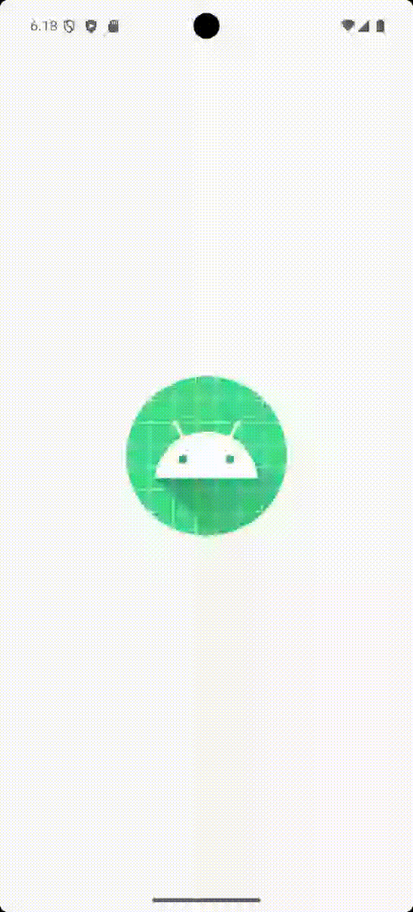
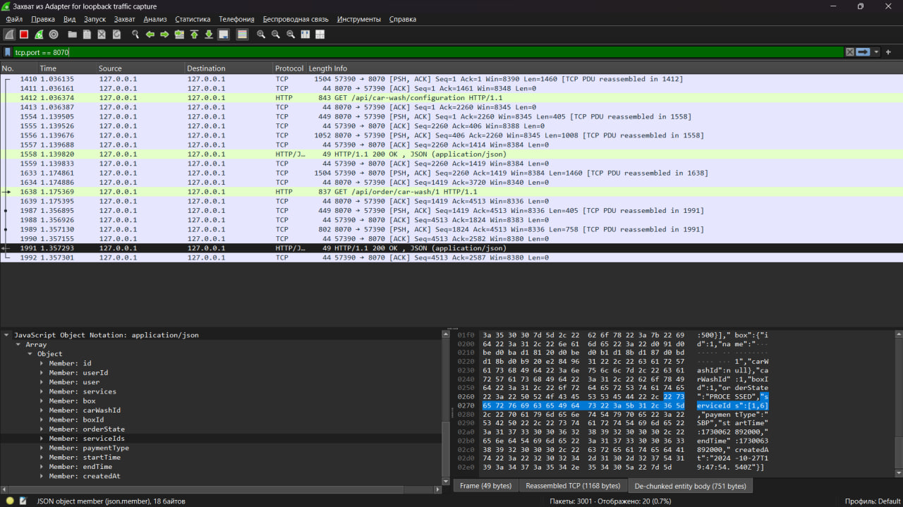

# Мобильное приложение проекта [Splash](https://github.com/Krayseer/splash)

## Архитектура
Приложение подразумевает два независимых приложения:
* **client-app** - клиентское приложение
* **partner-app** - партнерское приложение

## Первый этап: Создание UI

## Второй этап: Добавление API для получения данных с сервера
### Видеоролик работы приложения

### Скриншот выполнения запросов к серверу (Wireshark)

## Третий этап: Добавление избранных заказов и фильтрации по заказам

## Четвертый этап: Реализация страницы аккаунта с возможностью редактирования, загрузки фотографий и выгрузки отчета по автомойке пользователя
